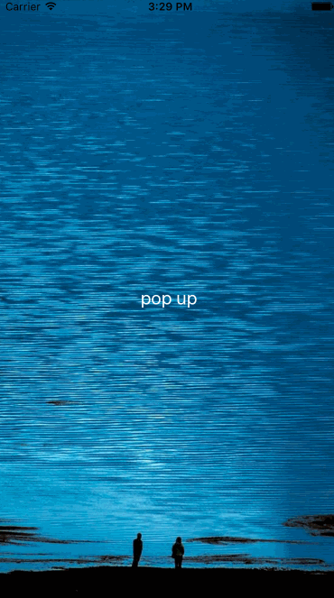
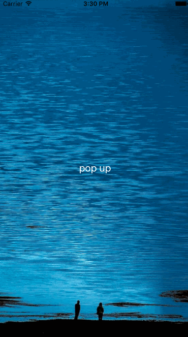

# UIViewController-PopUp
an extension of UIViewController for poping up a another ViewController with animation effects

# Feature
Fully customizable the poping up any viewController, it just do some animated effects

# Usage

```swift
  //custom your target poping up viewController anything you want, such as its bound size ...
  let pv          = UIViewController()
  pv.view.frame   = CGRectMake(0, 0, 300, 400)
  // set a type for poping up animation effect
  popUpEffectType = .FlipDown //.ZoomIn(default)/.ZoomOut/.FlipUp/.FlipDown
  presentPopUpViewController(pv)
```

# Install

- use cocoapods
```swift
pod 'UIViewController-PopUp', '~> 0.0.1'
```
- manual import
```swift
just download lib folder and add into your project
```

# Screenshot

- ZoomIn effect



- ZoomOut effect


- FlipUp effect



- FlipDown effect


# Release notes

- 0.0.1

`release first version.`
